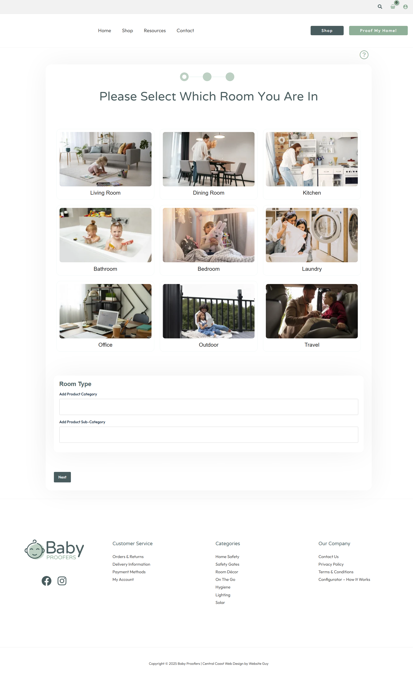
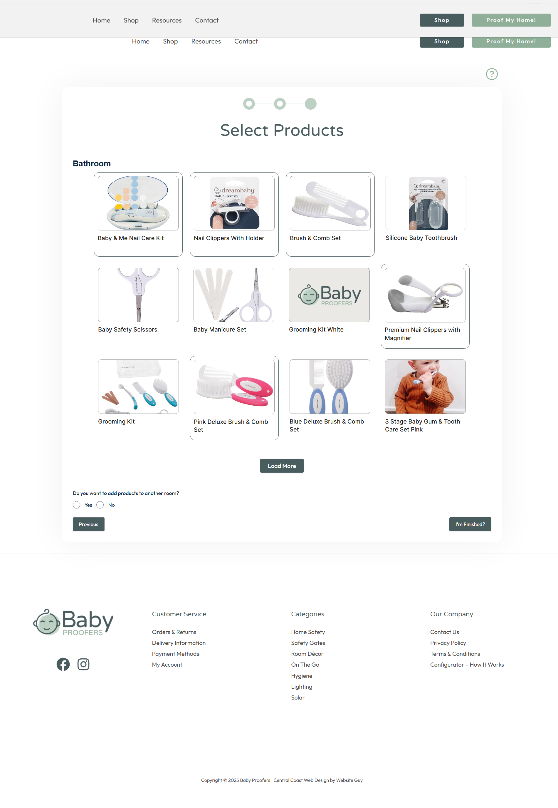
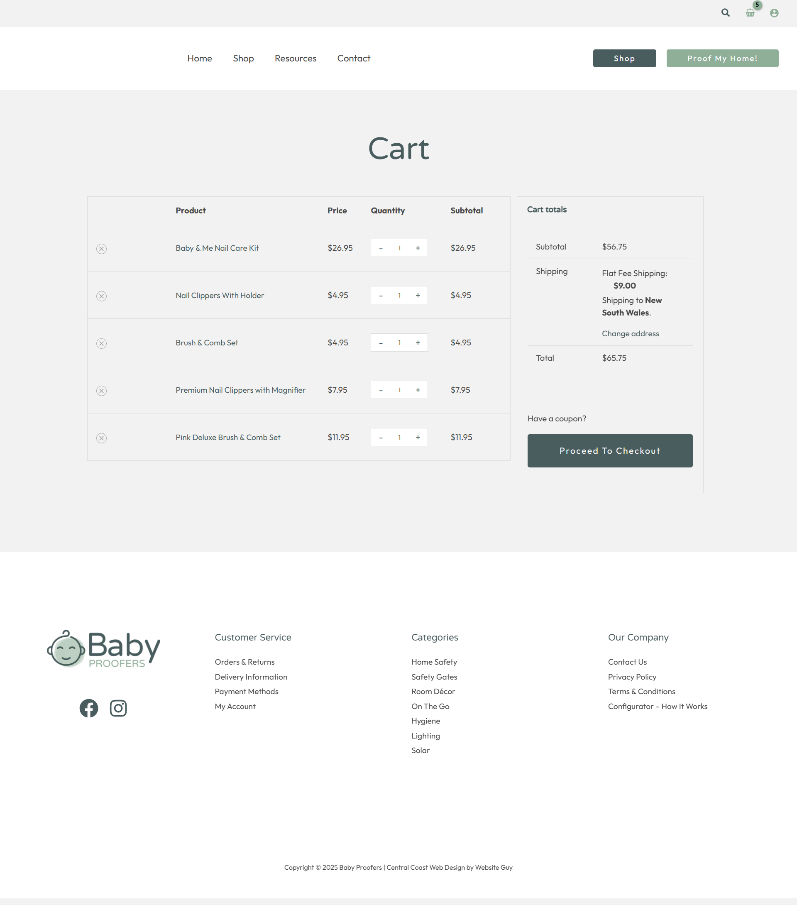

# 🍼 Baby Proofers - Gravity Forms + WooCommerce Integration

## 📘 Overview

This project implements a dynamic, multi-step **Gravity Form** integrated with **WooCommerce** to create an interactive baby proofing configurator.  
Users can select safety products for different rooms in their home, view product details directly in the form, and either **download a summary as a PDF** or **proceed to checkout**.

The solution uses **Gravity Perks**, **Gravity Flow**, and **custom PHP hooks** to create a seamless bridge between **WooCommerce products** and **Gravity Forms**.

---

## 🧩 Project Goals

- Build a **multi-step guided form** for room-by-room baby proofing.
- Dynamically populate **WooCommerce products** using **Gravity Perks - Populate Anything**.
- Show **image-based product choices** with pricing and names.
- Use **conditional logic** to show rooms based on user input (e.g., number of bedrooms).
- Provide **PDF download** and **WooCommerce checkout** options at the end.
- Ensure **room-specific product filtering** based on a spreadsheet mapping.

---

## 🧰 Plugins Used

| Plugin | Purpose |
|--------|----------|
| **Gravity Forms Elite** | Core form builder |
| **Gravity Flow** | Workflow and submission management |
| **Gravity Flow PDF** | Generates downloadable PDFs |
| **Gravity Perks - Populate Anything** | Dynamically populates form fields |
| **Gravity Perks - Nested Forms** | Embeds room-specific sub-forms |
| **WooCommerce** | Product management and checkout |

---

## ⚙️ Implementation Plan

### **Step 1: WooCommerce Product Setup**
- Import all baby proofing products into WooCommerce.
- Each product includes:
  - Title, price, image, SKU
  - Room mapping data (from spreadsheet)
  - Visibility: **Public**

---

### **Step 2: Product-to-Room Mapping**
Products are assigned to rooms using a reference spreadsheet.

| Product Name | Available In Rooms |
|---------------|-------------------|
| Cabinet Lock | Kitchen, Bathroom |
| Corner Guard | Living Room, Bedroom |
| Outlet Plug Cover | All Rooms |

This mapping ensures that only relevant products are displayed for each room.

---

### **Step 3: Master Form + Room Forms**
- The **Master Form** includes **Nested Room Forms**.
- Each **Room Form** contains product image choice fields populated from WooCommerce.
- Example rooms:
  - Living Room  
  - Kitchen  
  - Bathroom  
  - Bedroom(s) – conditional display  

---

### **Step 4: Dynamic Product Loading**
- Implemented using **Gravity Perks - Populate Anything**.
- Automatically loads WooCommerce product data into image choice fields.
- Each option displays:
  - Product Image  
  - Title  
  - Price  

---

### **Step 5: Conditional Logic**
Conditional display logic adapts the form based on user input.

Example:
- If the user selects **2 bedrooms**, only **Bedroom 1** and **Bedroom 2** pages appear.
- Conditional page logic controls navigation visibility.

---

### **Step 6: Multi-Page Form Flow**

| Step | Description |
|------|--------------|
| 1 | Welcome Page → User selects number of bedrooms |
| 2 | Living Room |
| 3 | Kitchen |
| 4 | Bathroom |
| 5 | Bedroom 1 |
| 6 | Bedroom 2 (conditional) |
| 7 | Bedroom 3 (conditional) |
| 8 | Summary / Checkout |

---

### **Step 7: Checkout and PDF Options**
At the final step, users can:
- **Download PDF Summary** (via Gravity Flow PDF)
- **Proceed to Checkout** (WooCommerce integration)
- **Do Both**

Custom PHP hooks handle adding selected products to the WooCommerce cart automatically.

---

### **Step 8: Testing & Validation**
- Verified all conditional logic and product-room mapping.
- Ensured correct product population in forms.
- Confirmed WooCommerce checkout redirection and PDF generation.

---

## 🧠 Custom Code

Custom PHP code was implemented to:
- Handle **WooCommerce cart population** based on selected form entries.
- Extend **Populate Anything** for additional filtering logic.
- Integrate **form submission hooks** for checkout and PDF generation.

All custom snippets are stored in the `/custom-code/` directory and linked within the Git repository.

---

## 🖼️ System Flow Diagram


### Flow Summary
1. User provides house details.
2. Form dynamically shows relevant rooms.
3. Products load based on room mapping.
4. User selects items visually.
5. User downloads a summary or proceeds to checkout.

---

## 📂 Repository Structure

```
babyproofers/
│
├── custom-code/
│   ├── populate-woocommerce-products.php
│   ├── add-to-cart-from-form.php
│   └── pdf-generation-hooks.php
│
├── screenshots/
│   ├── form-step-1.png
│   ├── form-step-2.png
│   └── form-summary.png
│
├── readme-assets/
│   └── flow-diagram.png
│
└── README.md
```

---

## ✅ Deliverables

- Fully functional multi-step Gravity Form
- Conditional logic per user input
- Dynamic WooCommerce product population
- Checkout and PDF export integration
- Tested and validated workflow

---

## 🔑 Notes

- Requires active **Gravity Perks** license for Populate Anything and Nested Forms.
- **Gravity Flow PDF** manages downloadable PDF logic.
- **WooCommerce hooks** manage cart actions after form submission.

---

## 🧾 Summary

This solution merges **Gravity Forms** flexibility with **WooCommerce** power to create a visual, room-based configurator for baby proofing.  
It allows customers to interactively build their safety product list, visualize each item, and proceed directly to checkout — creating a complete guided shopping experience.

---

## 📸 Screenshots

| Form Step | Description |
|------------|-------------|
|  | Room selection screen |
|  | Product selection per room |
|  | Summary and checkout options |

---

### Author
**Ghulam Qadir** – Web Developer (PHP, WordPress, Laravel)
